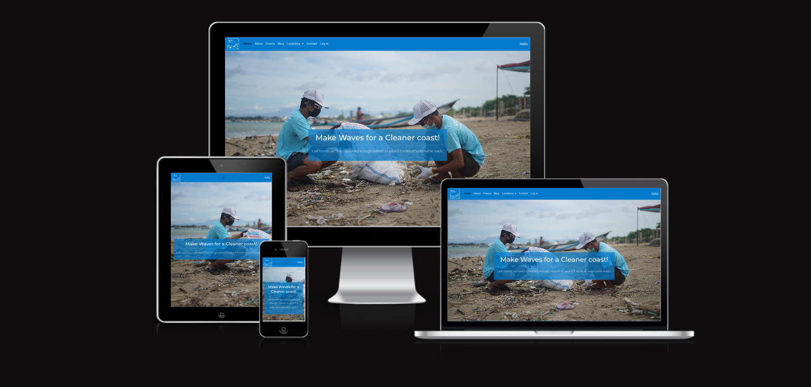
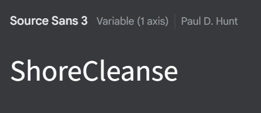

<h1 align="center">Tech for a Greener Tomorrow :    Hackathon for Sustainable Solutions 

</h1>

# SUBMISSION
## Deployment
#### _(Please note,  the deployed link is also included in the usual submission in Hackapp)_
The project is deployed and can be accessed at [here](https://shore-cleanse-0fb5ac9c4936.herokuapp.com/).

# ABOUT SUBMISSION
## Intro
ShoreCleanse is a site designed to encourage and help users find local beach clean up events in their area. It allows users to create profiles to connect with likeminded individuals for environmental events, document their trash collection (if they're from the west west, rubbish collection for the rest of the world), and provides updated statistics on environmental facts and figures.

## Goal
The goal of this project is to produce a functioning piece of technology that will benefit a greener tomorrow.  

Following the criteria set out by the hackathon facilitators and incorporating the hard work, sweat,  skills, abilities and testing of patience of each team member while enjoying the process of learning to develop new and unique software.

Some of the most important factors of the project include:

  - Organizing a group of <strike>weirdos </strike>strangers with varying abilities to join together to create a functioning site in a limited time frame with both frontend and backend from their, ehm, backends.
  - The languages used will be new to some members of the team (and less colorful for others), but will be a great learning curve for all.
  - Working together and seeing all members differing visions coming together in symphony, much like the frog chorus of yore.

## User Stories

* As a user, I want to be able to log into the website and browse upcoming beach cleanup events so that I can sign up for any that I might be interested in.
* As a user, I want to view photos of previous beach cleanups so that I can see the impact of the events and community involvement.
* As a user, I want to view upcoming events so that I can find more information about the event and join a beach clean up.
* As a user, I want to upload my trash collected to keep track of the waste on the shores and review my impact over time.
* As a user, I want to be able to navigate to a 'Where To Find Us' page so that I can find 'ShoreCleanse's location and contact details.

## Design
### Typography

- The font chosen for the site was Source Sans 3 - a Sans Serif font. It was picked from Google Fonts as we wanted an easy to read font that was inviting for a user to continue reading and browsing throughout the site.  

  

## Imagery
* Logo 
  * ShoreCleanse logo designed incorporating brands colorway using [Canva](https://www.canva.com) 

* Gallery and backround images
  * All images used throughout site are royalty free and sourced from [istock](www.istock.com) or taken by ourselves from our own personal photos.

## Wireframes

 - [Figma](www.figma.com) is a cloud-based design and prototyping tool that is widely used for creating user interfaces (UI) and user experience (UX) designs. 

## Tech
* HTML5
* CSS3
* Bootstrap
* JavaScript
* Django
* Python
* ElephantSQL
* API
* Heroku

## Local Deployment

In order to make a local copy of this project, you can clone it.
In your IDE Terminal, type the following command to clone our repository:

- `git clone https://github.com/KTC96/ShoreCleanse`

## Potential Future Features

- In the future adding a feature for users to upload their individual trash collection would be beneficial for users to monitor and display their efforts.

 - Adding some merchandise to an online store with a portion of the proceeds going towards the environmental efforts and utilizing a social media marketing campaign would help increase both the traffic to the site and funding for the environmental cause.

## Testing
The testing was completed mainly through team members rigourously hard refreshing all pages in multiple browsers and devices, which allowed us to identify various bugs that needed addressing.
To identify the source of bugs we used the following tools: 
- Our eyes 
- Developer Tools in various browsers (Console, Network, Lighthouse, Responsive Viewer) were used to check performance, responsiveness and SEOs.
- [WAVE - Web Accessibility Evaluation Tools](https://wave.webaim.org/) was used to assess accessibility.

- Through running these tests, we noticed that our accessibility and performance scores were a little lower than we would like. Given more time and with our next release, we will address these issues by possibly changing our images from jpg and png to WebP image files and adding more descriptive text to all visual aspects of the site.

The site was tested on the following browsers: 
- Firefox
- Chrome
- Safari
- Edge

## Bugs and fixing
* When trying to make images in the gallery uniform, a duplicated class threw off the images in the footer  

  * To fix it we first checked if we had entered into a portal and landed on a planet with more gravity, but then finally realized we just needed to rename a class in the gallery and apply the edits there. 
    

* We had issues while trying to edit our code - when trying to preview our changes error screens were showing. We figured out it wasbecause the Django servers were overloaded with multiple people accessing it at once.  

* Several design issues were encountered, at the beginning we had a couple of developers working on the same section, and realized our edits were over riding each other. As the hours progressed in the project and more caffeine was injected, we had a much tighter ship running and everything was controlled and synced.

## Programs Used

### Version Control

* [Github](https://github.com/) used to host repository.
* [Heroku](https://www.heroku.com/) used to deploy the website.
### Code Editors
* [VScode](https://code.visualstudio.com/) is  free and open-source code editor and customizable tool for writing code.
### Communications

* Our team mostly planned and communicated via [Slack](https://slack.com/intl/en-ie/) and carrier pigeons.  
  
  Slack is a widely-used cloud-based communication and collaboration platform designed to facilitate efficient communication and teamwork within organizations, teams, and communities.  
  
  Pigeons are birds.

## Credits
 
 Credit for blog post structure: [Bootdey](https://www.bootdey.com/snippets/view/Blog-Detail-App#html)
 
 
 **Thank you to all the team members for being sound. Oh, and for all the hard work and cooperation.**

  
 
  - **Kyle Clow** - [GitHub](https://github.com/KTC96), [LinkedIn](https://www.linkedin.com/in/kyle-clow-43471b130/)
  Scrum Master/ Frontend / Documentation
  - **Andrew Dempsey** - [GitHub](https://github.com/andrewdempsey2018), [LinkedIn](https://www.linkedin.com/in/andrew-dempsey-20ab40180/)
  Backend/ Frontend / Documentation
  - **Rinalds Zimelis** - [GitHub](https://github.com/rinalds98), [LinkedIn](https://www.linkedin.com/in/rinalds-zimelis/)
  Backend/Design/ Frontend / Documentation
  - **Ayla McCarthy** - [GitHub](https://github.com/Aylamccarthy), [LinkedIn](https://www.linkedin.com/in/ayla-mccarthy-a666565/)
   Design/ Frontend / Documentation
  - **Kim Hanlon** - [GitHub](https://github.com/kimatron), [LinkedIn](https://www.linkedin.com/in/kimhanlon291354)
   Design/ Frontend / Documentation